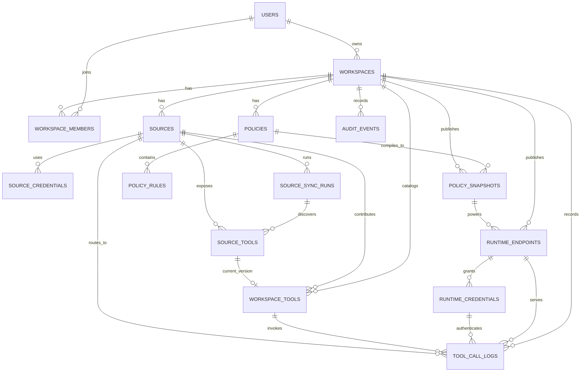

# Phase 0 - Initial ERD

## Objective

Define the first database model for MCPGate around its main target:

- a user connects multiple upstream MCP servers,
- MCPGate discovers tools from those sources,
- MCPGate exposes one centralized MCP endpoint,
- the workspace can enable or disable tools and apply policies before tools are exposed to downstream clients.

This ERD is the initial modeling source of truth before deeper TypeORM implementation.

## Modeling principles

1. Supabase Auth handles authentication.
2. MCPGate Postgres handles authorization, tenancy, source metadata, tool catalog state, policy state, runtime publication, and audit.
3. Do not model all tool concerns in one table.
4. Separate upstream discovery history from current exposed catalog state.
5. Keep ephemeral MCP session state out of Postgres in the first version.

## Core domains

### Identity and tenancy

- `users`
- `workspaces`
- `workspace_members`

### Source registry

- `sources`
- `source_credentials`
- `source_sync_runs`

### Tool catalog

- `source_tools`
- `workspace_tools`

### Policies

- `policies`
- `policy_rules`
- `policy_snapshots`

### Runtime publication

- `runtime_endpoints`
- `runtime_credentials`

### Audit and operations

- `audit_events`
- `tool_call_logs`

## Entity summary

### `users`

Purpose: local application identity linked to Supabase Auth identity.

Suggested fields:
- `id`
- `supabase_user_id`
- `email`
- `display_name`
- `status`
- `created_at`
- `updated_at`

### `workspaces`

Purpose: main tenant boundary for dashboard state, sources, tools, policies, runtime credentials, and audit.

Suggested fields:
- `id`
- `name`
- `slug`
- `owner_user_id`
- `status`
- `created_at`
- `updated_at`

### `workspace_members`

Purpose: user membership and RBAC assignment inside a workspace.

Suggested fields:
- `id`
- `workspace_id`
- `user_id`
- `role` (`owner | admin | operator | viewer`)
- `status`
- `created_at`
- `updated_at`

### `sources`

Purpose: one configured upstream MCP server connection inside a workspace.

Suggested fields:
- `id`
- `workspace_id`
- `name`
- `source_key`
- `type` (`custom | supabase | slack | future adapters`)
- `transport` (`stdio | http`)
- `endpoint_url`
- `status` (`pending | connected | error | disconnected`)
- `last_connected_at`
- `last_error`
- `created_at`
- `updated_at`

Notes:
- `source_key` should be stable inside one workspace.
- `endpoint_url` may be nullable for non-HTTP adapter types.

### `source_credentials`

Purpose: auth material or secret references used to connect from MCPGate runtime/control plane to the upstream source.

Suggested fields:
- `id`
- `source_id`
- `credential_type` (`api_key | bearer | oauth | basic | env | custom`)
- `secret_ref`
- `encrypted_payload`
- `is_valid`
- `last_validated_at`
- `created_at`
- `updated_at`

Notes:
- do not store plain secrets retrievably unless strongly necessary.
- prefer encrypted payloads or secret references.

### `source_sync_runs`

Purpose: discovery execution history for source validation and tool sync runs.

Suggested fields:
- `id`
- `source_id`
- `status` (`running | success | error`)
- `started_at`
- `finished_at`
- `discovered_tools_count`
- `error_message`
- `metadata_json`

### `source_tools`

Purpose: historical snapshot of a tool discovered from an upstream source during a specific sync run.

Suggested fields:
- `id`
- `source_id`
- `sync_run_id`
- `upstream_tool_name`
- `canonical_tool_key`
- `title`
- `description`
- `input_schema`
- `output_schema`
- `annotations`
- `capability_hint` (`read | write | admin | unknown`)
- `is_current`
- `discovered_at`

Notes:
- this is discovery history, not the final exposed tool catalog.
- `canonical_tool_key` should remain stable inside the workspace, typically `sourceKey:toolName`.

### `workspace_tools`

Purpose: current operational catalog of tools exposed or considered for exposure inside the workspace.

Suggested fields:
- `id`
- `workspace_id`
- `source_id`
- `current_source_tool_id`
- `canonical_tool_key`
- `display_name`
- `description`
- `is_enabled`
- `visibility_status`
- `last_seen_at`
- `created_at`
- `updated_at`

Notes:
- this is where the product toggle really lives.
- this table should represent the current view that policy and runtime consume.

### `policies`

Purpose: named policy container, versioned over time.

Suggested fields:
- `id`
- `workspace_id`
- `name`
- `scope_type` (`workspace | project | role`)
- `scope_ref`
- `status` (`draft | published | archived`)
- `version`
- `created_by`
- `created_at`
- `updated_at`

### `policy_rules`

Purpose: atomic allow/deny rules inside one policy.

Suggested fields:
- `id`
- `policy_id`
- `target_type` (`tool | source | capability`)
- `target_ref`
- `effect` (`allow | deny`)
- `conditions_json`
- `priority`
- `created_at`

### `policy_snapshots`

Purpose: compiled policy state published for runtime evaluation.

Suggested fields:
- `id`
- `workspace_id`
- `policy_id`
- `compiled_rules_json`
- `published_by`
- `published_at`

Notes:
- runtime should prefer snapshots over building policies from scratch on every request.

### `runtime_endpoints`

Purpose: one published centralized MCP endpoint for a workspace.

Suggested fields:
- `id`
- `workspace_id`
- `name`
- `slug`
- `status`
- `base_url`
- `published_policy_snapshot_id`
- `created_at`
- `updated_at`

### `runtime_credentials`

Purpose: API keys or future runtime client credentials used by downstream clients to access the centralized MCP endpoint.

Suggested fields:
- `id`
- `workspace_id`
- `runtime_endpoint_id`
- `label`
- `hashed_key`
- `scope_project_id`
- `allowed_client_label`
- `expires_at`
- `revoked_at`
- `created_by`
- `created_at`

Notes:
- plain runtime key should be shown once and never stored raw.

### `audit_events`

Purpose: audit trail for dashboard actions and security-sensitive lifecycle events.

Suggested fields:
- `id`
- `workspace_id`
- `actor_type` (`user | runtime_client | system`)
- `actor_ref`
- `event_type`
- `target_type`
- `target_ref`
- `metadata_json`
- `created_at`

### `tool_call_logs`

Purpose: runtime execution log for allowed, denied, and failed tool calls.

Suggested fields:
- `id`
- `workspace_id`
- `runtime_endpoint_id`
- `runtime_credential_id`
- `workspace_tool_id`
- `source_id`
- `request_payload_json`
- `response_summary_json`
- `decision` (`allowed | denied | failed`)
- `latency_ms`
- `error_code`
- `created_at`

## Initial relationships

## What should not be modeled in Postgres first

- transient MCP connection state
- per-request lifecycle handshake messages
- in-memory runtime sessions
- transport-level buffers or SSE stream cursors

Those are better handled in memory or Redis when runtime implementation begins.

## Recommended implementation order

1. `users`, `workspaces`, `workspace_members`
2. `sources`, `source_credentials`, `source_sync_runs`
3. `source_tools`, `workspace_tools`
4. `policies`, `policy_rules`, `policy_snapshots`
5. `runtime_endpoints`, `runtime_credentials`
6. `audit_events`, `tool_call_logs`

## Main design decision

The most important modeling decision is this:

- `source_tools` stores discovery history from upstream MCP servers
- `workspace_tools` stores the current tool catalog that MCPGate exposes and toggles

Without this separation, discovery history, active state, policy targeting, and runtime publishing would become tightly coupled and hard to evolve.
